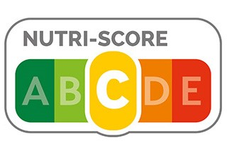

# PRÉPARER DES DONNÉES POUR UN ORGANISME DE SANTÉ PUBLIQUE

Projet realisé en juin 2024 dans le cadre de ma formation Data Scientist avec CentraleSupélec/OpenClassrooms.

## Objectif du projet

Une agence de santé publique souhaite améliorer sa base de données open source, qui est mise à la disposition de particuliers et d’organisations afin de leur permettre de connaître la qualité nutritionnelle de produits de consommation courante. Aujourd’hui, pour ajouter un produit à cette base de données, il est nécessaire de remplir de
nombreux champs textuels et numériques, ce qui peut conduire à des erreurs de saisie et à des valeurs
manquantes dans la base; l'agence de santé publique souhaite déterminer la faisabilité d’un système de suggestion ou d’autocomplétion pour aider les usagers à remplir plus efficacement la base de données. Une attention particulière sera portée au respect du RGPD dans l'automatisation des traitements, compte-tenu de la nature communautaire de l'application, dont les enrichissements reposent sur des contributions du public.

## Méthodologie du Nutri-Score

Pour une information complète sur les principes nutritionnels et scientifiques ayant présidé à la création du Nutri-Score, le lecteur est invité à se référer aux travaux du Professeur Serge Hercberg et de son équipe, dont on citera pour exemple:  

S. Hercberg, M. Touvier, and J. Salas-Salvado, “The Nutri-Score nutrition label: A public health tool based on rigorous scientific evidence aiming to improve the nutritional status of the population,” International Journal for Vitamin and Nutrition Research, vol. 92, no. 3–4, pp. 147–157, Jul. 2022, doi: 10.1024/0300-9831/a000722  

disponible sur https://econtent.hogrefe.com/doi/full/10.1024/0300-9831/a000722.

Le bilan à 3 ans de l'implémentation du Nutri-Score est disponible ici : https://sante.gouv.fr/IMG/pdf/nutri-score_follow-up_report_3_years_26juillet2021.pdf

L'information sur les changements récents apportés à la méthodologie du Nutri-Score (et qui ont notamment conduit au reclassement de nombreux produits) sont disponibles auprès de Santé Publique France :

https://www.santepubliquefrance.fr/les-actualites/2024/nutri-score-le-point-sur-les-nouveautes-2024

## Liste des fichiers

Les données-source sont disponibles sur https://world.openfoodfacts.org/ on en téléchargement direct sur https://s3-eu-west-1.amazonaws.com/static.oc-static.com/prod/courses/files/parcours-data-scientist/P2/fr.openfoodfacts.org.products.csv.zip

La définition des variables est disponible sur https://world.openfoodfacts.org/data/data-fields.txt

* **fichiers :**
	- **notebook_1.ipynb :** code Python permettant l'import des fichiers .csv et leur nettoyage
  - **notebook_2.ipynb :** code Python permettant l'analyse exploratoire des données et la production des graphiques et statistiques descriptives uni-et bi-variées
  - **slideshow.pdf :** diapositives de présentation du projet
  - **slideshow_notes.pdf :** notes d’accompagnement des diapositives de présentation du projet
  - **Nutri-Score_brochure_EN.pdf :** note éducative sur le Nutri-Score (en anglais)

## Compétences développées

* Déterminer les objectifs du nettoyage des données et de la démarche de mise en œuvre
* Effectuer des analyses statistiques univariées et multivariées
* Effectuer des opérations de nettoyage sur des données structurées
* Représenter des données grâce à des graphiques afin justifier les analyses réalisées

## Langages & software

* Python 3.13.2

Voir requirements.txt pour la liste complète des librairies & packages.
  

## MENTIONS LÉGALES

Cette étude a été produite par CelineBoutinon sur la base des données en libre-accès sur https://world.openfoodfacts.org/ et par référence au Nutri-Score mis en place par Santé Publique France en octobre 2017. Ni Open Food Facts ni Santé Publique France ne donnent aucune garantie quant à l’exactitude, l’exhaustivité ou l’adéquation à l’usage des données et ne sauraient être tenus responsables de toute utilisation ou dépendance à l’égard de ces données, ni des analyses ou conclusions qui en découlent. Ni Open Food Facts ni Santé Publique France n’endosse ni ne certifie aucune analyse, interprétation ou conclusion présentée ici, qui restent la responsabilité seule de l'auteure. Pour plus de détails, veuillez consulter les conditions d’utilisation sur https://world.openfoodfacts.org/code-of-conduct.

